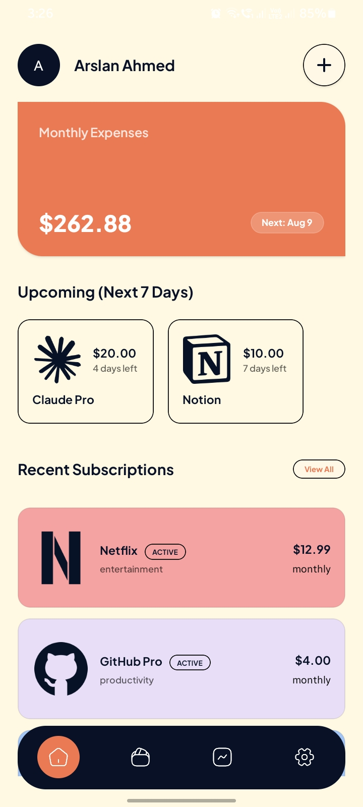
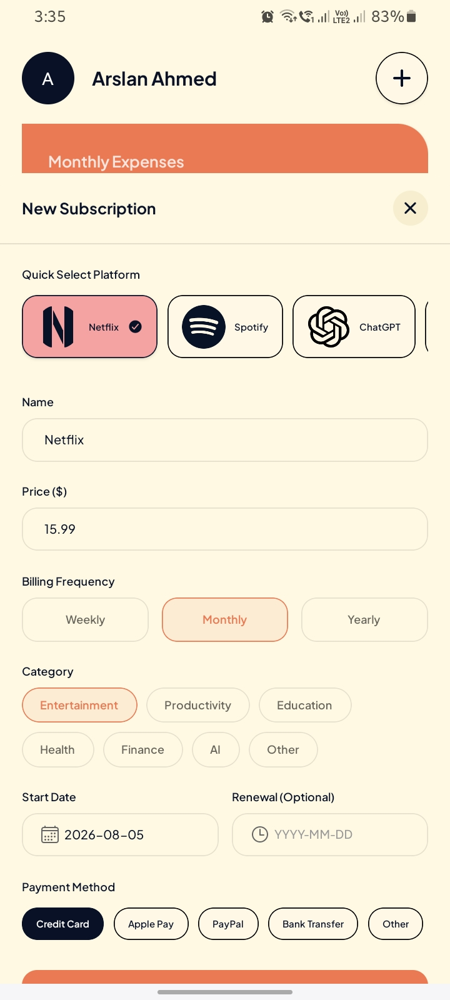
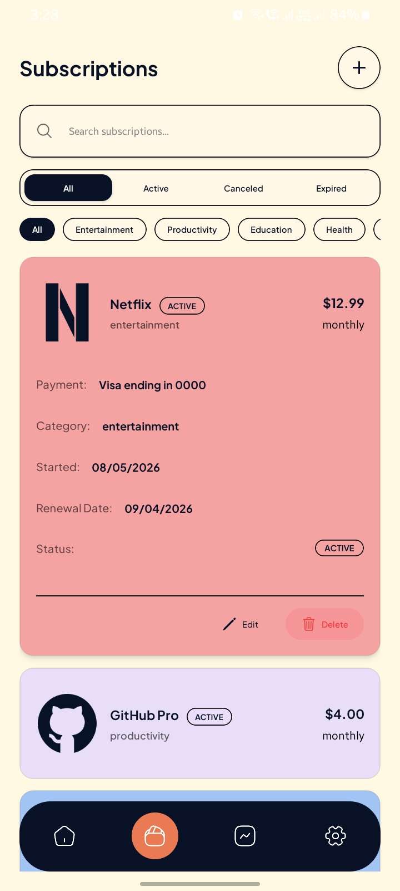
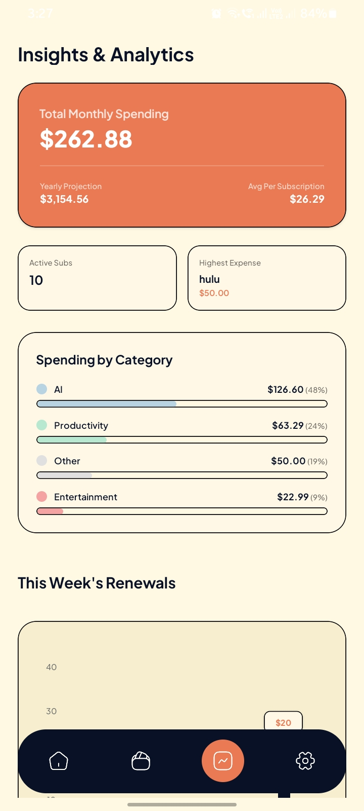
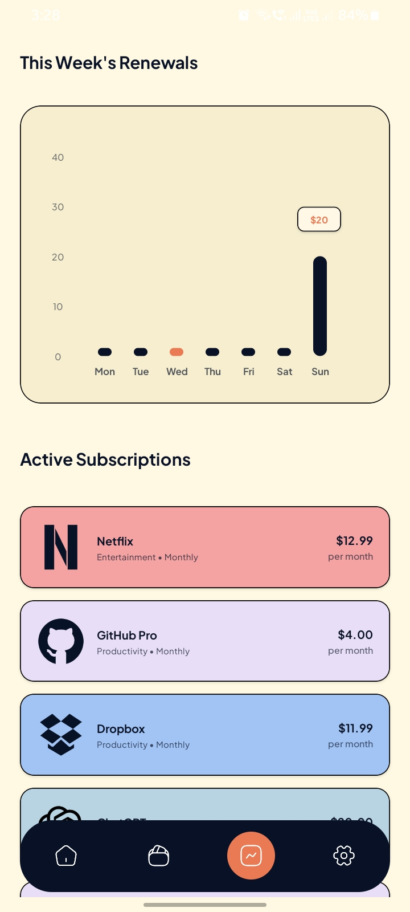
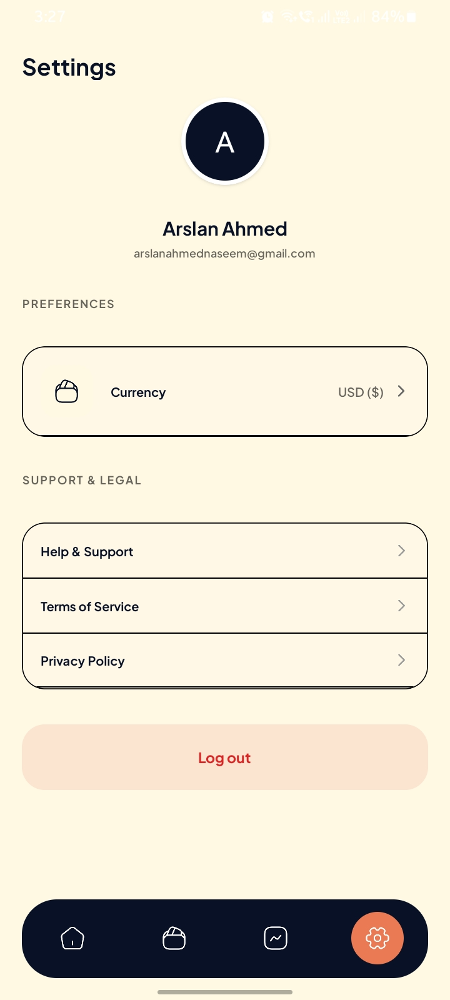

<div align="center">
  
  
  # Renovo
  **The definitive personal subscription tracking & expense manager.**
  
  [](https://reactnative.dev/)
  [](https://expo.dev/)
  [](https://nodejs.org/)
  [](https://expressjs.com/)
  [](https://www.mongodb.com/)
  [](https://clerk.com/)
  [](https://render.com/)

  <br/>
  
  [](https://github.com/mearslanahmed/renovo/releases)

  <br/>

  <p align="center">
    Renovo is a next-generation subscription tracking application built for Android and iOS. It combines robust expense tracking with automated reminder workflows to make sure you never experience unexpected billing charges. The backend API is fully deployed and hosted on <strong>Render</strong>.
  </p>
</div>

---

## Features

- **Secure Authentication:** Sign-up (supporting full name inputs), sign-in, and verification (OTP) flows managed securely via Clerk.
- **Subscription Tracker:** Add, edit, and delete subscription records. Track billing frequencies (Weekly, Monthly, Yearly), start dates, optional renewal dates, category tags, payment methods, and custom brand colors.
- **Dashboard Overview (Home):** View total monthly subscription costs, next closest renewal date, upcoming renewals carousel for the next 7 days, and recent active subscriptions with a quick link to the full library.
- **Library Hub:** A dedicated subscriptions view featuring real-time title search, category filter chips, and status segmented controls (`All`, `Active`, `Canceled`, `Expired`).
- **Insights & Analytics:** Interactive charts to visualize your monthly active commitments, yearly projection estimates, average subscription costs, category spending breakdowns, and weekly renewals schedule bar charts.
- **Global Currencies Selector:** Live app-wide preference setting supporting USD, EUR, GBP, INR, PKR, JPY, CAD, AUD, and RP. with local SecureStore caching.
- **Automated Workflows:** Backend email notification system powered by Upstash Workflow and Brevo API to send users friendly email reminders before renewal dates.

## Screenshots

| Home Dashboard | Subscription Creator | Subscription Manager |
| :---: | :---: | :---: |
|  |  |  |

| Spend Projections | Analytics & Charts | Settings & Preferences |
| :---: | :---: | :---: |
|  |  |  |

---

## Tech Stack

### Frontend & Mobile
- **React Native (0.81.5)** with **Expo (54.0)** for cross-platform compilation.
- **Expo Router (6.0)** for modern, file-based navigation.
- **TypeScript** for strict type-safety across the entire codebase.
- **React Native Gifted Charts** for data visualization.
- **Expo Secure Store** for persisted currency preferences.
- **PostHog React Native** for tracking key user engagement events.

### Backend & Cloud
- **Express & Node.js** for hosting the REST API routes, deployed on **Render**.
- **Mongoose & MongoDB** for storing user subscription records.
- **Arcjet Middleware** for enterprise-grade security, rate-limiting, and bot protection.
- **Upstash Workflow** for automating the reminder queue workflows.
- **Brevo API (SMTP)** for reliable email reminder deliveries.
- **Svix** for secure webhook signature validation.

---

## Project Structure

```text
renovo/
├── backend/
│   ├── config/            # Server env and Upstash configuration
│   ├── controllers/       # Route request controllers (Subscriptions, Workflows, Webhooks)
│   ├── database/          # MongoDB connection handler
│   ├── middlewares/       # Security (Arcjet) and error handling middlewares
│   ├── models/            # Mongoose Schemas (User, Subscription)
│   ├── routes/            # Express endpoints declarations
│   ├── utils/             # Helper services (Brevo SMTP email utility)
│   └── app.js             # Server entryway
└── mobile/
    ├── app/               # Expo Router directory (Auth pages, Tab layouts, Subscriptions details)
    ├── assets/            # Fonts, Icons, and Images
    ├── components/        # Reusable UI widgets (SubscriptionCard, UserAvatar, Modals)
    ├── constants/         # App constants, image mappings
    ├── context/           # React Context Providers (Subscriptions, Currency)
    ├── lib/               # API clients, local formatting utility
    └── global.css         # Main Tailwind design system CSS file
```

---

## API Endpoints

### Subscriptions (`/api/v1/subscriptions`)
| Method | Endpoint | Auth | Description |
| :--- | :--- | :---: | :--- |
| **GET** | `/` | Yes | Get all active/canceled subscriptions for the user |
| **POST** | `/` | Yes | Create a new subscription record |
| **GET** | `/:id` | Yes | Get detailed information for a single subscription |
| **PUT** | `/:id` | Yes | Update an existing subscription |
| **DELETE** | `/:id` | Yes | Delete a subscription record |
| **PUT** | `/:id/cancel` | Yes | Cancel subscription status |
| **GET** | `/upcoming-renewals` | Yes | Fetch subscriptions renewing within the next 7 days |

### Users, Webhooks & Workflows
| Method | Endpoint | Auth | Description |
| :--- | :--- | :---: | :--- |
| **GET** | `/api/v1/users/:id` | Yes | Fetch logged-in user profile details |
| **POST** | `/api/v1/webhooks/clerk` | Webhook | Svix-verified user sync events from Clerk |
| **POST** | `/api/v1/workflows/subscription/reminder` | Upstash | Triggers automated email notifications before billing |

---

## Getting Started

### Quick Install (Android APK)
If you want to install and run the application directly on an Android device without building from source:
1. Go to the [Releases](https://github.com/mearslanahmed/renovo/releases) page.
2. Download the latest release of `renovo.apk`.
3. Install the APK on your device (you may need to allow installation from unknown sources).

### Prerequisites
- Node.js (v18+ recommended)
- MongoDB instance (Atlas or local)
- Clerk Account (for auth configuration)
- Upstash account (for workflow queues)
- Brevo account (for SMTP delivery)

### Backend Setup
1. Navigate to the backend directory:
   ```bash
   cd backend
   ```
2. Install dependencies:
   ```bash
   npm install
   ```
3. Create a `.env.development.local` file using the variables described in the **Environment Variables** section.
4. Launch the server in development mode:
   ```bash
   npm run dev
   ```

### Mobile Setup
1. Navigate to the mobile directory:
   ```bash
   cd ../mobile
   ```
2. Install dependencies:
   ```bash
   npm install
   ```
3. Create a `.env` file with your configuration variables.
4. Start the Expo development server:
   ```bash
   npx expo start -c
   ```

---

## Environment Variables

### Backend (`/backend/.env.development.local`)
- `PORT`: Server listening port (e.g. `3000`)
- `NODE_ENV`: Runtime environment (`development` or `production`)
- `DB_URI`: MongoDB connection string
- `CLERK_PUBLISHABLE_KEY`: Clerk Publishable API Key
- `CLERK_SECRET_KEY`: Clerk Secret API Key
- `CLERK_WEBHOOK_SECRET`: Svix endpoint verification secret for Clerk webhook synchronization
- `ARCJET_KEY`: Arcjet Security validation key
- `QSTASH_URL`: Upstash QStash REST endpoint
- `QSTASH_TOKEN`: Upstash QStash authentication token
- `EMAIL`: Brevo sender email address
- `EMAIL_PASSWORD`: Brevo SMTP API key
- `SERVER_URL`: Public address of backend server (used by Upstash to route reminders)

### Mobile (`/mobile/.env`)
- `EXPO_PUBLIC_API_URL`: Root address of Express server API (e.g. `http://localhost:3000/api/v1`)
- `EXPO_PUBLIC_CLERK_PUBLISHABLE_KEY`: Clerk authentication publishable key
- `POSTHOG_PROJECT_TOKEN`: PostHog SDK project tracking token
- `POSTHOG_HOST`: PostHog telemetry server URL

---

## Developer & Contact

**Arslan Ahmed**
- Portfolio: [arslanahmed.me](https://arslanahmed.me)
- Business & Freelance Inquiries: [arslanahmednaseem@gmail.com](mailto:arslanahmednaseem@gmail.com)
- GitHub: [@mearslanahmed](https://github.com/mearslanahmed)

---

## License

This project is licensed under the MIT License - see the [LICENSE](LICENSE) file for details.

