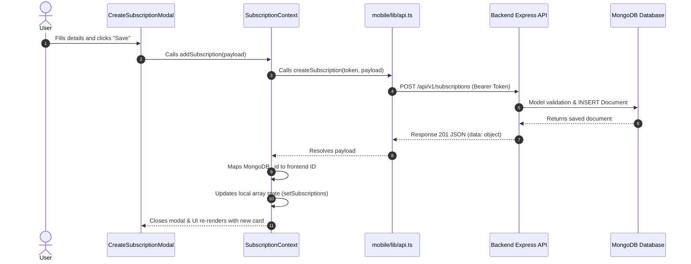

# Renovo — Technical Documentation

**Project Name**: Renovo  
**Description**: Renovo is a next-generation subscription tracking and personal expense management application built for Android and iOS. It features secure authentication via Clerk, local currency preferences persisted via SecureStore, dynamic charts via Gifted Charts, and automated backend email renewal reminders powered by Upstash Workflow and Brevo SMTP.  
**Current Documentation Status**: Completed  
**Last Updated Date**: August 5, 2026  

---

# 1. Project Overview

Renovo solves the common consumer problem of "subscription bloat" and forgotten billing cycles. Users often sign up for free trials or recurring services (entertainment, productivity tools, cloud storage) and forget to cancel them before they renew. Renovo addresses this by offering:
- **Centralized Tracking**: A dedicated dashboard and library listing all active, canceled, or expired subscriptions.
- **Insights & Visualizations**: Charts showing monthly active commitment costs, yearly projection estimates, category spending splits, and weekly renewal schedules.
- **Automated Reminder Pipelines**: A robust backend workflow that detects upcoming renewals and triggers email reminders to the user before they are billed.
- **Cross-Platform Access**: Built with React Native and Expo, targeting both Android and iOS devices.

---

# 2. Technology Stack

| Technology | Purpose | Evidence / Usage |
| :--- | :--- | :--- |
| **React Native (0.81.5)** | Core mobile application framework for cross-platform execution. | Declared in `mobile/package.json`. |
| **Expo (54.0.35)** | Development environment, build tooling, and native platform client APIs. | Declared in `mobile/package.json`. |
| **Expo Router (6.0.24)** | Modern file-based navigation router. | Configured in `mobile/app/` folders. |
| **TypeScript (5.9.2)** | Strict type-safety across frontend schemas and components. | Configured in `mobile/tsconfig.json`. |
| **Node.js & Express (5.2.1)**| Backend REST API server hosting. | Configured in `backend/app.js` and `backend/package.json`. |
| **Mongoose & MongoDB** | Object data modeling (ODM) and database storage. | Configured in `backend/database/mongodb.js` and models. |
| **Clerk Auth** | Identity provider for secure authentication and token generation. | Configured in `mobile/app/_layout.tsx` and `backend/middlewares/auth.middleware.js`. |
| **Arcjet Middleware** | Enterprise security middleware (rate-limiting, bot protection). | Configured in `backend/middlewares/arcjet.middleware.js`. |
| **Upstash Workflow** | Scheduled execution of reminder notification workflows. | Configured in `backend/controllers/workflow.controller.js`. |
| **Brevo API (SMTP)** | Email distribution handler for automated alerts. | Configured in `backend/utils/email-service.js`. |
| **Svix** | Webhook verification for Clerk-to-MongoDB sync. | Used in `backend/controllers/webhook.controller.js`. |
| **PostHog React Native** | Product analytics and user event tracking. | Integrated in `mobile/lib/posthog.ts` and `mobile/app/_layout.tsx`. |
| **Expo Secure Store** | Secure key-value storage for currency preference. | Used in `mobile/context/CurrencyContext.tsx`. |
| **Gifted Charts** | Rendering complex graphical spending charts. | Used in `mobile/app/(tabs)/insights.tsx`. |
| **TailwindCSS / NativeWind** | Component styling framework. | Used in `mobile/global.css` and UI components. |

---

# 3. Project Architecture

Renovo is designed with a decoupled Client-Server architecture:

```mermaid
flowchart TD
    subgraph Frontend Mobile Client (React Native + Expo)
        UI[UI Components & Screens]
        Contexts[Currency & Subscription Contexts]
        SecureStore[Expo SecureStore]
        APIClient[Fetch API Client]
        ClerkSDK[Clerk SDK Auth]
        PostHog[PostHog Analytics]
    end

    subgraph Backend API Services (Express + Node.js)
        Express[Express Server]
        AuthMiddleware[Clerk Auth Middleware]
        ArcjetMiddleware[Arcjet Security Middleware]
        Routes[API Routes & Controllers]
    end

    subgraph Cloud Infrastructure & Databases
        MongoDB[(MongoDB Atlas)]
        Upstash[Upstash Workflow Service]
        Brevo[Brevo SMTP Email Provider]
        Clerk[Clerk Auth Server]
    end

    UI --> Contexts
    Contexts --> SecureStore
    Contexts --> APIClient
    APIClient --> ClerkSDK
    ClerkSDK -- Bearer JWT --> Express
    Express --> AuthMiddleware
    Express --> ArcjetMiddleware
    AuthMiddleware --> Routes
    Routes --> MongoDB
    Routes --> Upstash
    Upstash -- Scheduled Tasks --> Express
    Routes --> Brevo
    Clerk -- Webhooks --> Express
    UI --> PostHog
```

### Application Layers:
1. **Presentation Layer (Frontend UI)**: File-based router views inside `mobile/app` using React components.
2. **State & Cache Layer**: Context Providers (`SubscriptionContext`, `CurrencyContext`) managing globally accessible data.
3. **Network Layer**: A clean fetch-based client wrapper inside `mobile/lib/api.ts` which forwards Clerk Authorization headers.
4. **Backend Gateway (Security & Routing)**: Express router configured with Arcjet rate-limiting and Clerk token verification.
5. **Business/Service Layer**: Controller business logic handling database state, scheduling Upstash workflow reminders, and executing Brevo emails.
6. **Data Layer**: Persistent MongoDB collections storing user and subscription entities.

---

# 4. Complete Project Structure

```text
renovo/
├── LICENSE
├── README.md
├── DOCUMENTATION.md
├── screenshots/               # Application UI screenshots
│   ├── 01_splash-screen.jpg
│   ├── 02_signup-screen.jpg
│   ├── 03_signin-screen.jpg
│   ├── 04_otp-verification-screen.jpg
│   ├── 05_home-screen.jpg
│   ├── 06_new-subscription-screen.jpg
│   ├── 07_all-subscription-screen.jpg
│   ├── 08_insight&analytic-screen-01.jpg
│   ├── 09_insight&analytic-screen-02.jpg
│   ├── 10_settings-screen.jpg
│   └── 11_email-reminder.jpg
├── backend/                  # REST API backend server
│   ├── config/
│   │   ├── arcjet.js         # Arcjet security setup
│   │   ├── env.js            # Environment variable validation & exports
│   │   └── upstash.js        # Upstash workflow client configuration
│   ├── controllers/
│   │   ├── subscription.controller.js # Subscription CRUD operations
│   │   ├── user.controller.js         # User CRUD operations
│   │   ├── webhook.controller.js      # Clerk webhook sync logic
│   │   └── workflow.controller.js     # Upstash email notification scheduler
│   ├── database/
│   │   └── mongodb.js        # MongoDB connection configuration
│   ├── middlewares/
│   │   ├── arcjet.middleware.js # Arcjet security application handler
│   │   ├── auth.middleware.js   # Custom Clerk authorization verification
│   │   └── error.middleware.js  # Global Express error interceptor
│   ├── models/
│   │   ├── subscription.model.js # Subscription Mongoose schema
│   │   └── user.model.js         # User Mongoose schema
│   ├── routes/
│   │   ├── subscription.routes.js
│   │   ├── user.routes.js
│   │   ├── webhook.routes.js
│   │   └── workflow.route.js
│   ├── utils/
│   │   └── email-service.js   # Brevo SMTP transport utility
│   ├── app.js                # Express app routes mounting & configuration
│   └── package.json          # Backend dependencies and run scripts
└── mobile/                   # Expo React Native client
    ├── app/
    │   ├── (auth)/           # Authentication flows (Layout, Sign-in, Sign-up)
    │   ├── (tabs)/           # Navigation Tab group (Home, Subscriptions, Insights, Settings)
    │   ├── Subscriptions/    # Subscription detail page
    │   ├── _layout.tsx       # Root layout provider configuration
    │   ├── index.tsx         # Initial router entrypoint
    │   └── onboarding.tsx    # App welcome slider screen
    ├── assets/               # Fonts, Icons, and Images
    ├── components/           # Modular reusable UI widgets
    ├── constants/            # Styling themes, mock data, and icon mapping
    ├── context/              # Context Providers (Subscription, Currency)
    ├── lib/                  # Fetch API config, PostHog telemetry Client
    ├── global.css            # Tailwind / NativeWind global stylesheet
    ├── app.json              # Expo application configuration settings
    └── package.json          # Frontend dependency configuration
```

---

# 5. Application Entry Point

The mobile application starts via **Expo Router** which points to `mobile/app/_layout.tsx` as the main layout hierarchy.

### Startup Sequence:
1. **Fonts & Assets Loading**: The `useFonts` hook loads the `PlusJakartaSans` family from `mobile/assets/assets/fonts/`.
2. **Splash Screen Blocking**: `SplashScreen.preventAutoHideAsync()` keeps the splash screen active. Once fonts are ready (or error out), `SplashScreen.hideAsync()` is triggered.
3. **Root Provider Mounting**: The app wraps the tree in:
   - `ClerkProvider` (using `publishableKey` and `tokenCache` for local session persistence).
   - `PostHogProvider` (initializing custom analytics client).
4. **Auth Hand-off**: `mobile/app/index.tsx` checks Clerk's `isSignedIn` flag.
   - If signed in: Redirects to `/(tabs)`.
   - If not signed in: Redirects to `/onboarding`.

---

# 6. Navigation Architecture

Navigation is managed dynamically using **Expo Router**. The hierarchy is structured as follows:

```mermaid
flowchart TD
    Index[Entry: index.tsx] -->|Unauthenticated| Onboarding[onboarding.tsx]
    Index -->|Authenticated| Tabs[/(tabs) Tab Navigation]
    
    Onboarding --> AuthStack[/(auth) Stack]
    AuthStack --> SignIn[sign-in.tsx]
    AuthStack --> SignUp[sign-up.tsx]
    
    Tabs --> Home[index.tsx]
    Tabs --> Subs[subscriptions.tsx]
    Tabs --> Insights[insights.tsx]
    Tabs --> Settings[settings.tsx]

    Home --> Details[Subscriptions/[id].tsx]
    Subs --> Details
```

### Route Definitions:
- `app/index.tsx`: Redirection controller.
- `app/onboarding.tsx`: Introduces the application features using a swipe slider.
- `app/(auth)/_layout.tsx`: Stack navigator managing auth transitions.
- `app/(tabs)/_layout.tsx`: Bottom Tab Navigator displaying tabs with custom icon mappings.
- `app/Subscriptions/[id].tsx`: Stack overlay displaying detailed info for a single subscription ID.

---

# 7. Screen-by-Screen Documentation

## Onboarding Screen
* **Purpose**: Provide a welcoming intro slider with feature slides and a Call-to-Action to begin authentication.
* **Location**: `mobile/app/onboarding.tsx`
* **UI Components**: Swiper slides, text headers, secondary styled pagination indicators, and custom primary buttons.
* **User Actions**: Swipe slides, click "Get Started" to route to Sign-In.
* **Navigation**: Links directly to `/sign-in`.
* **Visual Reference**: Matches `screenshots/01_splash-screen.jpg`.

## Sign-In Screen
* **Purpose**: Authenticate existing users via email/password.
* **Location**: `mobile/app/(auth)/sign-in.tsx`
* **UI Components**: Custom text fields, password visibility toggles, loading spinners, and error alerts.
* **User Actions**: Input email, input password, trigger sign-in, redirect to sign-up.
* **API / Backend**: Connects directly to the Clerk Auth service.
* **Navigation**: On success, Clerk updates session state triggering redirection to `/(tabs)`.
* **Visual Reference**: Matches `screenshots/03_signin-screen.jpg`.

## Sign-Up Screen
* **Purpose**: Register new users (requiring Name, Email, and Password) and complete OTP verification.
* **Location**: `mobile/app/(auth)/sign-up.tsx`
* **UI Components**: Registration fields, OTP Verification Modal containing digit inputs, and error labels.
* **User Actions**: Input details, submit, receive and enter verification code.
* **API / Backend**: Clerk creates the user profile. Once verified, Clerk triggers a webhook sync to MongoDB (`/api/v1/webhooks/clerk`).
* **Visual Reference**: Matches `screenshots/02_signup-screen.jpg` and `screenshots/04_otp-verification-screen.jpg`.

## Home Screen (Dashboard)
* **Purpose**: High-level overview of subscription stats, upcoming renewals, and quick-add actions.
* **Location**: `mobile/app/(tabs)/index.tsx`
* **UI Components**: Dynamic metrics card (Total monthly spending), Horizontal renewals carousel (7-day window), list of recent subscriptions, user profile header, and custom action floating buttons.
* **State**: Retrieves active currency symbol from `useCurrency` and subscriptions from `useSubscriptions`.
* **API / Backend**: Fetches subscriptions from `/api/v1/subscriptions` and upcoming renewals from `/api/v1/subscriptions/upcoming-renewals`.
* **Visual Reference**: Matches `screenshots/05_home-screen.jpg`.

## Subscriptions Library Screen
* **Purpose**: Browse, search, filter, and modify all user subscriptions.
* **Location**: `mobile/app/(tabs)/subscriptions.tsx`
* **UI Components**: Text search input, category selection chips, status Segmented Control (`All`, `Active`, `Canceled`, `Expired`), scrollable `SubscriptionCard` list, and `CreateSubscriptionModal`.
* **User Actions**: Search title, filter categories, change status view, tap card to inspect details, open Create modal.
* **Visual Reference**: Matches `screenshots/07_all-subscription-screen.jpg` and `screenshots/06_new-subscription-screen.jpg`.

## Insights & Analytics Screen
* **Purpose**: Visualize subscription analytics through detailed interactive charts.
* **Location**: `mobile/app/(tabs)/insights.tsx`
* **UI Components**: Stacked renewals bar chart, average cost stats, category split pie chart, and yearly projection cost forecast lists.
* **Third-Party Libraries**: `react-native-gifted-charts`.
* **Visual Reference**: Matches `screenshots/08_insight&analytic-screen-01.jpg` and `screenshots/09_insight&analytic-screen-02.jpg`.

## Settings Screen
* **Purpose**: Modify configuration preferences and logout.
* **Location**: `mobile/app/(tabs)/settings.tsx`
* **UI Components**: Currency selector modal button, user information card, notification preferences toggles, and Logout Button.
* **State**: Modifies local SecureStore state for `CurrencyContext`.
* **Visual Reference**: Matches `screenshots/10_settings-screen.jpg`.

---

# 8. Component Architecture

| Component | Location | Purpose | Used By |
| :--- | :--- | :--- | :--- |
| `SubscriptionCard` | `components/SubscriptionCard.tsx` | Renders a single subscription item card with name, cost, category tag, frequency, color highlight, and icon. | `subscriptions.tsx`, `index.tsx` |
| `UpcomingSubscriptionCard` | `components/UpcomingSubscriptionCard.tsx` | Renders upcoming renewal alerts for the next 7 days in a compact view. | `index.tsx` (Home) |
| `SubscriptionIcon` | `components/SubscriptionIcon.tsx` | Resolves and displays the correct branded PNG image icon (Netflix, Spotify, etc.) or a default wallet fallback. | `SubscriptionCard.tsx`, `[id].tsx` |
| `CreateSubscriptionModal` | `components/CreateSubscriptionModal.tsx` | Screen-covering slide-up modal containing inputs for name, cost, frequency, color, start date, payment method, and category. | `subscriptions.tsx` |
| `EditSubscriptionModal` | `components/EditSubscriptionModal.tsx` | Similar modal populated with existing values allowing modification and cancellation triggers. | `[id].tsx` |
| `UserAvatar` | `components/UserAvatar.tsx` | Renders user's dynamic profile picture, utilizing initial fallbacks if no avatar is linked. | `index.tsx`, `settings.tsx` |

---

# 9. State Management

Renovo utilizes two primary frontend context structures to avoid overhead state libraries:

### 1. `SubscriptionContext` (`mobile/context/SubscriptionContext.tsx`)
* **Stored State**: `subscriptions` (array of subscription models), `isLoading` (fetching state indicator).
* **Sync Strategy**:
  - `addSubscription()` makes a `POST` request to the backend and appends the resolved item to local state.
  - `updateSubscription()` makes a `PUT` request and map-replaces the updated item in local state.
  - `deleteSubscription()` makes a `DELETE` request and filters out the corresponding item locally.
  - Resolves icons and branding colors locally (`resolveIcon`, `resolveColor`) if none are supplied by the backend.

### 2. `CurrencyContext` (`mobile/context/CurrencyContext.tsx`)
* **Stored State**: `currency` (current preference string, e.g. `USD`, `PKR`).
* **Persistence**: Uses `expo-secure-store` to retrieve/save the user's currency code.

---

# 10. Data Flow

### Subscription Creation Flow Example:



---

# 11. Backend / API Integration

### API Routes & Controllers:
The Express backend mounts routers at `/api/v1/...` and protects them using Clerk's authorization checks.

| Route Endpoint | Method | Middleware | Controller Function | Purpose |
| :--- | :---: | :--- | :--- | :--- |
| `/api/v1/users/:id` | **GET** | `authorize` | `getUser` | Fetches MongoDB profile details. |
| `/api/v1/users/:id` | **PUT** | `authorize` | `updateUser` | Updates user parameters in MongoDB. |
| `/api/v1/subscriptions` | **GET** | `authorize` | `getUserSubscriptions` | Fetches active subscriptions for logged-in user. |
| `/api/v1/subscriptions` | **POST** | `authorize` | `createSubscription` | Validates, saves subscription, and schedules reminders. |
| `/api/v1/subscriptions/:id` | **GET** | `authorize` | `getSubscription` | Fetches a single subscription profile. |
| `/api/v1/subscriptions/:id` | **PUT** | `authorize` | `updateSubscription` | Modifies existing subscription details. |
| `/api/v1/subscriptions/:id`| **DELETE** | `authorize` | `deleteSubscription` | Deletes a subscription record. |
| `/api/v1/subscriptions/:id/cancel` | **PUT** | `authorize` | `cancelSubscription` | Toggles subscription status to `canceled`. |
| `/api/v1/subscriptions/upcoming-renewals` | **GET** | `authorize` | `getUpcomingRenewals` | Returns subscriptions renewing in the next 7 days. |
| `/api/v1/webhooks/clerk` | **POST** | `express.raw()` | `clerkWebhook` | Receives Clerk webhook sync events (user creation/deletion). |
| `/api/v1/workflows/subscription/reminder` | **POST** | *None* | `sendReminders` | Triggered by Upstash Workflow for scheduler runs. |

### Advanced integrations:
- **Upstash Workflow**: During subscription creation, a workflow is registered with Upstash. Upstash acts as a highly reliable serverless cron engine that pings `/api/v1/workflows/subscription/reminder` to execute delayed actions (checking renewal dates and running email reminder tasks).
- **Brevo Email Service**: Uses the `nodemailer` SMTP package configuration (configured at `backend/utils/email-service.js`) to dispatch customized reminder alerts.
- **Svix Verification**: Verifies incoming Clerk webhook signatures inside `clerkWebhook` to prevent spoofing.

---

# 12. Database Architecture

Mongoose defines two main schemas inside `backend/models`:

### 1. `User` Schema (`user.model.js`)
* `name`: String, required, trimmed, 3-50 characters.
* `email`: String, required, lowercase, validated using standard email regex, unique.
* `clerkId`: String, required, unique index. Holds the primary Clerk User identifier.

### 2. `Subscription` Schema (`subscription.model.js`)
* `name`: String, required, 2-100 characters.
* `price`: Number, required, minimum value of 0.
* `currency`: String, enum: `['USD', 'EUR', 'GBP', 'INR', 'PKR', 'JPY', 'CAD', 'AUD', 'RP.']`.
* `frequency`: String, enum: `['daily', 'weekly', 'monthly', 'yearly']`.
* `category`: String, enum: `['entertainment', 'productivity', 'education', 'health', 'finance', 'ai', 'other']`.
* `paymentMethod`: String, required.
* `status`: String, enum: `['active', 'canceled', 'expired']`, default `active`.
* `startDate`: Date, required, must not be in the future.
* `renewalDate`: Date, computed automatically if omitted (based on frequency). Must be after `startDate`.
* `user`: ObjectId referencing `User` model, indexed.

---

# 13. Authentication & Authorization

Authentication is managed completely through **Clerk**.

1. **Frontend Flow**:
   - Clerk handles login, signup, session caching, and secure token rotation.
   - Using Clerk's `useAuth()` hook, the client obtains a JWT token: `const token = await getToken();`.
2. **Backend Authentication**:
   - Incoming REST API calls send this token in the header: `Authorization: Bearer <token>`.
   - The custom `authorize` middleware (`backend/middlewares/auth.middleware.js`) extracts the token, checks signature validation via Clerk's middleware, extracts the Clerk user ID, looks up the corresponding profile in the local MongoDB instance, and assigns it to `req.user`.

---

# 14. Local Storage / Persistence

Renovo implements `expo-secure-store` to handle currency preferences:
- File: `mobile/context/CurrencyContext.tsx`
- Key Name: `user_preferred_currency`
- On startup, the `CurrencyProvider` checks if a value exists under this key. If found, it updates local state.
- When modified, `setCurrency` updates local state and writes the new code back to SecureStore.

---

# 15. Environment Configuration

### Backend variables (`backend/.env.development.local` / `backend/.env.production.local`):
* `PORT`: Server port (e.g. `3000`).
* `NODE_ENV`: Runtime execution context.
* `DB_URI`: MongoDB connection string.
* `CLERK_PUBLISHABLE_KEY`: Clerk Publishable Key.
* `CLERK_SECRET_KEY`: Clerk Secret Key.
* `CLERK_WEBHOOK_SECRET`: Clerk endpoint verification token.
* `ARCJET_KEY`: Arcjet validation key.
* `QSTASH_URL`: Upstash QStash REST endpoint.
* `QSTASH_TOKEN`: Upstash QStash authorization token.
* `EMAIL`: Brevo sender email address.
* `EMAIL_PASSWORD`: Brevo SMTP API key.
* `SERVER_URL`: Server endpoint address used by Upstash callback hooks.

### Mobile variables (`mobile/.env`):
* `EXPO_PUBLIC_API_URL`: Root address of the Express API backend.
* `EXPO_PUBLIC_CLERK_PUBLISHABLE_KEY`: Clerk Publishable key.
* `POSTHOG_PROJECT_TOKEN`: PostHog SDK tracking token.
* `POSTHOG_HOST`: PostHog analytics collection endpoint.

---

# 16. Theme & Design System

The visual design system of Renovo uses a highly curated, premium aesthetic utilizing NativeWind (TailwindCSS integration for React Native):

- **Typography**: Uses the `PlusJakartaSans` font family in Light, Regular, Medium, SemiBold, Bold, and ExtraBold weights.
- **Color Scheme**: Uses dark background accents (`#121212`) combined with customized cards using unique branding colors:
  - Netflix: `#f5a2a2` (Red tint)
  - Spotify: `#d0a2f5` (Purple/Green tint)
  - ChatGPT/OpenAI/Claude: `#b8d4e3` (AI Blue tint)
  - GitHub: `#e8def8` (Developer Indigo tint)
  - Adobe: `#f5c542` (Yellow/Gold tint)
  - Canva/Notion: `#b8e8d0` (Mint/Green tint)
  - Dropbox: `#a2c4f5` (Sky Blue tint)
- **Border Radius & Spacing**: Generous use of rounded elements (`rounded-2xl`, `rounded-3xl`) and glassmorphism styling parameters.

---

# 17. Dependencies

### Frontend (`mobile/package.json`):
- `expo`: Framework platform core.
- `expo-router`: Core routing module.
- `nativewind`: Native CSS engine.
- `@clerk/expo`: Frontend auth integration.
- `react-native-gifted-charts`: Charts engine.
- `posthog-react-native`: Telemetry and events capture.
- `react-native-reanimated` & `react-native-gesture-handler`: Fluid UI animations.

### Backend (`backend/package.json`):
- `express`: Core routing engine.
- `mongoose`: MongoDB ODM schema tool.
- `@clerk/express`: Backend auth token checker.
- `@upstash/workflow`: Scheduling reminder worker pipelines.
- `svix`: Clerk webhook security parser.
- `@arcjet/node` & `@arcjet/inspect`: Security rate-limiting.

---

# 18. Development Setup

### Requirements:
- Node.js (v18+)
- MongoDB Atlas account (or local MongoDB database instance)
- Git CLI

### Installation:
1. Clone the repository and navigate to the project directory:
   ```bash
   git clone https://github.com/mearslanahmed/renovo.git
   cd renovo
   ```

2. Setup Backend:
   ```bash
   cd backend
   npm install
   # Create .env.development.local file and configure variables
   npm run dev
   ```

3. Setup Mobile:
   ```bash
   cd ../mobile
   npm install
   # Create .env file and configure API variables
   npx expo start -c
   ```

---

# 19. Known Limitations

- **Email SMTP Dependability**: Renewal notifications depend entirely on the availability of the configured Brevo SMTP credentials and the Upstash Workflow runner state.
- **Local Currency Conversions**: Changing the application currency updates the displayed currency symbol across the app, but does not perform currency conversion rate math on the underlying price float values.
- **Offline Actions**: If the backend server goes down or fails to connect to MongoDB, the app cannot execute CRUD operations as it relies fully on the live REST API for data retrieval.
